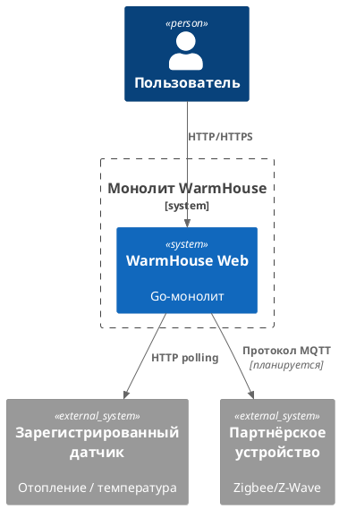
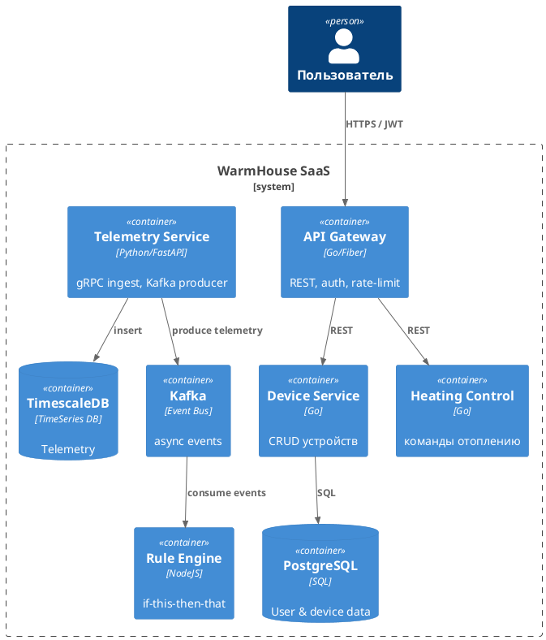
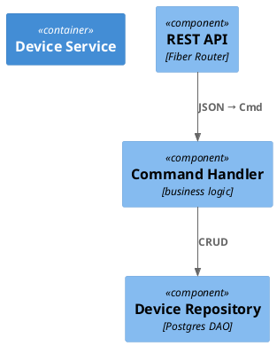
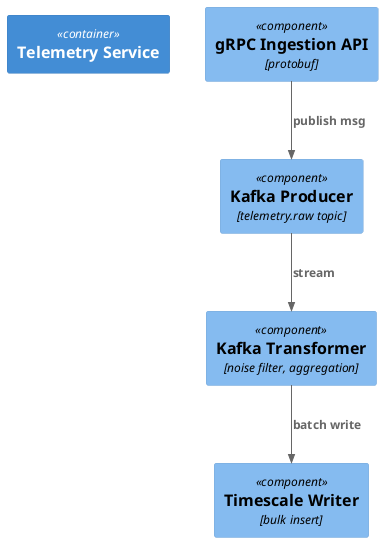
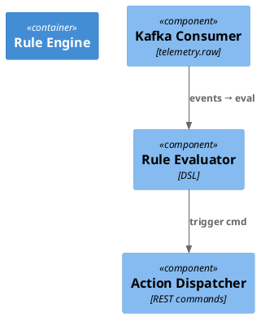
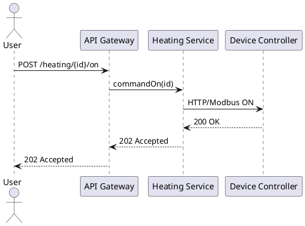
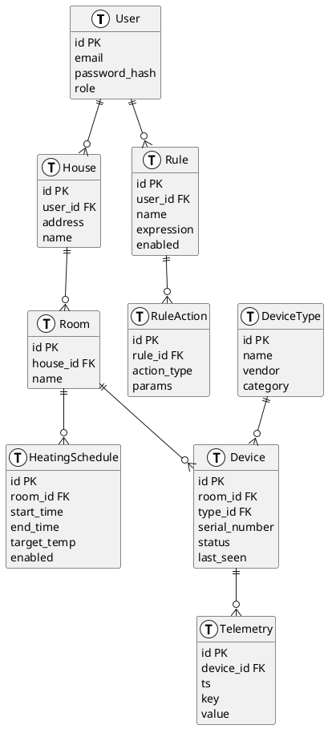

# Project_template

# Задание 1. Анализ и планирование

### 1. Описание функциональности монолитного приложения

**Управление отоплением:**

- Пользователь из веб‑UI отправляет команду «вкл/выкл» конкретному котлу/радиатору.
- Сервер напрямую (синхронно по HTTP) вызывает контроллер устройства.
- Статус контроллера хранится в DB (допустим, `heating_state`).

**Мониторинг температуры:**

- Раз в 60 секунд сервер опрашивает датчик температуры по REST‑endpoint /temp
- Полученную данные (допустим, `sensor_id, value, ts`) пишет в  DB (`temperature_data`)
- Пользователи могут проверять в UI текущую температуру по дому (а также историю температуры).

### 2. Анализ архитектуры монолитного приложения

- Язык программирования: Go 1.22
- База данных: PostgreSQL 16
- Архитектура: Монолитная, все компоненты системы (обработка запросов, бизнес-логика, работа с данными) находятся в рамках одного приложения.
- Взаимодействие: Синхронное, запросы обрабатываются последовательно.
- Масштабируемость: Ограничена, так как монолит сложно масштабировать по частям.
- Развертывание: Требует остановки всего приложения.

### 3. Определение доменов и границы контекстов

|     Контекст      |                  Краткое предназначение                  |
| ----------------- | -------------------------------------------------------- |
| Heating           | управление котлами/радиаторами (команды, расписания)     |
| Device Registry   | CRUD устройств и их метаданных (серийник, прошивка, тип) |
| Telemetry         | приём и хранение потоковых данных от датчиков            |
| User & Auth       | аккаунты, роли, JWT‑auth                                 |
| Automation Rules  | движок сценариев «если … то …»                           |
| Billing (будущее) | SaaS‑подписки и оплата                                   |


### 4. Проблемы монолитного решения

- Высокий риск ошибок и непредсказуемые побочные эффекты - изменение логики опроса всего одного датчика может обрушить цикл управления котлом, потому что код контроллеров устройств хранится в общем пакете и разделяет глобальное состояние.
- Долгие циклы разработки и развёртывания - даже небольшая доработка (например, поддержка датчика влажности) требует полного regression‑тест‑прогона и релиза всего контейнера; при деплое монолит недоступен ≈ 30 с, команды «вкл/выкл» разрываются.
- Трудно управлять командой - 3‑5 разработчиков одновременно меняют один репозиторий; миграция схемы БД в Heating блокирует работу Telemetry, merge‑конфликты часты.
- Невозможно масштабировать отдельные компоненты - рост телеметрии (от 200 к 2000 датчиков) удушит CPU и I/O сервера, но придётся «растить» весь монолит, включая малонагруженный Auth и UI.
- Тесная связка кода и данных - слои DAO жёстко привязаны к схеме PostgreSQL; любая миграция - это релиз + потенциальный downtime, откат сложен.
- Downtime при релизах - единый процесс = единая точка отказа; нет возможности выкатывать features по частям, нет blue/green для отдельных доменов.

### 5. Визуализация контекста системы — диаграмма С4



# Задание 2. Проектирование микросервисной архитектуры

**Диаграмма контейнеров (Containers)**



**Диаграмма компонентов (Components)**







**Диаграмма кода (Code)**



# Задание 3. Разработка ER-диаграммы



# Задание 4. Создание и документирование API

### 1. Тип API

|                   Канал                    |                Характер                |  Выбранный тип API   |              Обоснование               |
| ------------------------------------------ | -------------------------------------- | -------------------- | -------------------------------------- |
| CRUD (пользователи, устройства, отопление) | запрос‑ответ, критично «видеть» статус | REST / OpenAPI 3.0   | простые синхронные операции            |
| Поток телеметрии температур                | fire‑and‑forget, 1000+ msg/с           | Kafka / AsyncAPI 3.0 | буферизация, масштабирование consumers |


### 2. Документация API

[Device Service](api/device-openapi.yaml)

[Heating Service](api/heating-openapi.yaml)

[Auth Service](api/auth-openapi.yaml)

[Telemetry Bus](api/telemetry-asyncapi.yaml)

# Задание 5. Работа с docker и docker-compose

Перейдите в apps.

Там находится приложение-монолит для работы с датчиками температуры. В README.md описано как запустить решение.

Вам нужно:

1) сделать простое приложение temperature-api на любом удобном для вас языке программирования, которое при запросе /temperature?location= будет отдавать рандомное значение температуры.

Locations - название комнаты, sensorId - идентификатор названия комнаты

```
	// If no location is provided, use a default based on sensor ID
	if location == "" {
		switch sensorID {
		case "1":
			location = "Living Room"
		case "2":
			location = "Bedroom"
		case "3":
			location = "Kitchen"
		default:
			location = "Unknown"
		}
	}

	// If no sensor ID is provided, generate one based on location
	if sensorID == "" {
		switch location {
		case "Living Room":
			sensorID = "1"
		case "Bedroom":
			sensorID = "2"
		case "Kitchen":
			sensorID = "3"
		default:
			sensorID = "0"
		}
	}
```

2) Приложение следует упаковать в Docker и добавить в docker-compose. Порт по умолчанию должен быть 8081

3) Кроме того для smart_home приложения требуется база данных - добавьте в docker-compose файл настройки для запуска postgres с указанием скрипта инициализации ./smart_home/init.sql

Для проверки можно использовать Postman коллекцию smarthome-api.postman_collection.json и вызвать:

- Create Sensor
- Get All Sensors

Должно при каждом вызове отображаться разное значение температуры

Ревьюер будет проверять точно так же.


